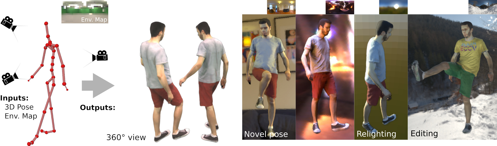

# Relightable Neural Actor

This repository is the official implementation of the paper:
> **Relightable Neural Actor with Intrinsic Decomposition and Pose Control**, [ECCV 2024](https://eccv.ecva.net/)<br>
><a href="https://people.mpi-inf.mpg.de/~dluvizon" target="_blank">Diogo C. Luvizon</a> | <a href="https://people.mpi-inf.mpg.de/~golyanik" target="_blank">Vladislav Golyanik</a> |  <a href="https://adamkortylewski.com" target="_blank">Adam Kortylewski</a> | <a href="https://people.mpi-inf.mpg.de/~mhaberma" target="_blank">Marc Habermann</a> | <a href="http://people.mpi-inf.mpg.de/~theobalt" target="_blank">Christian Theobalt</a><br>
> **Project**: <a href="https://vcai.mpi-inf.mpg.de/projects/RNA/" target="_blank">link</a><br>

## Abstract

<div style="text-align: justify">Creating a controllable and relightable digital avatar from multi-view video with fixed illumination is a very challenging problem since humans are highly articulated, creating pose-dependent appearance effects, and skin as well as clothing require space-varying BRDF modeling. Existing works on creating animatible avatars either do not focus on relighting at all, require controlled illumination setups, or try to recover a relightable avatar from very low cost setups, i.e. a single RGB video, at the cost of severely limited result quality, e.g. shadows not even being modeled. To address this, we propose Relightable Neural Actor, a new video-based method for learning a pose-driven neural human model that can be relighted, allows appearance editing, and models pose-dependent effects such as wrinkles and self-shadows. Importantly, for training, our method solely requires a multi-view recording of the human under a known, but static lighting condition. To tackle this challenging problem, we leverage an implicit geometry representation of the actor with a drivable density field that models pose-dependent deformations and derive a dynamic mapping between 3D and UV spaces, where normal, visibility, and materials are effectively encoded. To evaluate our approach in real-
world scenarios, we collect a new dataset with four identities recorded under different light conditions, indoors and outdoors, providing the first
benchmark of its kind for human relighting, and demonstrating state-of-the-art relighting results for novel human poses.
</div>



## Installation

Please follow the instructions [here](./INSTALL.md).


## Dataset and Trained Models

For downloading and processing the _Relightable Dynamic Actors_ (RDA) Dataset, refer to [dataset](./DATASET.md).

Since the models are trained on data from real persons, before downloading the weights for research purposes, registration is required. Please follow the instructions [ [here](https://gvv-assets.mpi-inf.mpg.de/RNA/) ].


## Inference

```sh
python -m rna.valid \
   --experiment "demo_S1T1" \
   --data_root "data/processed/RelightableDynamicActor/S1/T1" \
   --relight_weights "checkpoints/S1/checkpoints/neura_weights_relight_exp_473E_017.pt" \
   --envmap_path "data/RelightableDynamicActor/S1/T1/light_probe/envmap/hdri_combined_low_res.hdr" \
   --valid_frames "100..200..10" \
   --valid_cameras "7,19,28,32,39" \
   --relight \
   --clip_canonical \
   --static_albedo \
   --use_uv_nets \
   --tex_file_ext "png" \
   --load_frames
```

The default output path will be at `./output/$experiment`.


<!-- ## Training from Scratch -->


## Citation

```
@inproceedings{relightneuralactor2024eccv,
title = {Relightable Neural Actor with Intrinsic Decomposition and Pose Control},
author = {Luvizon, Diogo and Golyanik, Vladislav and Kortylewski, Adam and Habermann, Marc and Theobalt, Christian},
year = {2024},
booktitle={European Conference on Computer Vision (ECCV)},
}
```


## License

Please see the License Terms in the [LICENSE](./LICENSE) file.

